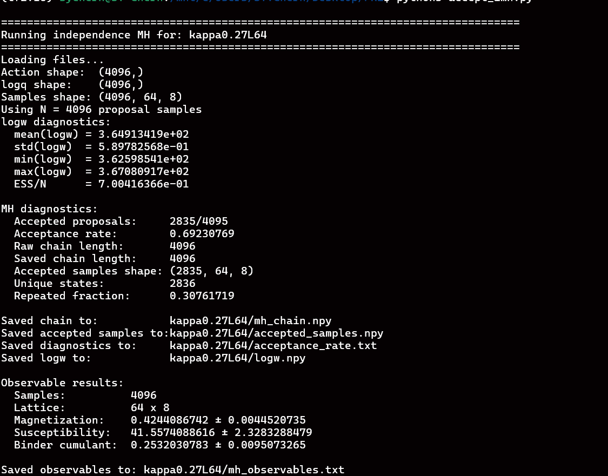

# Stochastic Path Sampler for Lattice Field Theory

TensorFlow implementation of the **Stochastic Path Sampler (SPS)** for two-dimensional lattice scalar field theory.

This repository accompanies:

> **Stochastic Path Sampler for Lattice Field Theory**  
> arXiv:2606.13790 [hep-lat]  
> DOI: https://doi.org/10.48550/arXiv.2606.13790

## Overview

The Stochastic Path Sampler constructs learnable forward and backward stochastic dynamics between a simple prior distribution and an unnormalized lattice-field target distribution,

$$ \pi(\phi)=\frac{1}{Z}e^{-S(\phi)}. $$

The forward process generates field configurations, while an auxiliary backward process is used to evaluate a trajectory-level probability ratio. Training minimizes a path-space variational objective that does not require samples from the target distribution.

This implementation includes:

- a two-dimensional scalar $\phi^4$ lattice action;
- periodic convolutional layers;
- learnable forward and backward drift networks;
- Fourier time embeddings;
- a learnable diffusion schedule;
- optional lattice-symmetry transformations;
- training and configuration-generation scripts.

## Lattice action

The implemented lattice action is

$$ S[\phi] = \sum_x \left[ (1-2\lambda)\phi_x^2 + \lambda\phi_x^4 - 2\kappa\sum_{\mu}\phi_x\phi_{x+\hat\mu} \right]. $$

Here:

- $\kappa$ is the hopping parameter;
- $\lambda$ is the quartic coupling;
- periodic boundary conditions are imposed in every lattice direction.

The action is implemented in `Action.py`.

## Stochastic dynamics

Let $N$ denote the number of discrete stochastic steps and

$$ \Delta t=\frac{1}{N}. $$

A forward transition is represented schematically as

$$ \phi_{i+1} = \phi_i + \sigma_\theta^2(t_i) K_{\theta,\mathrm F}(\phi_i,t_i) + \sigma_\theta(t_i)\sqrt{\Delta t}\eta_i, $$

with

$$ \eta_i\sim\mathcal N(0,I). $$

The auxiliary backward transition is represented as

$$
\phi_i = \phi_{i+1} + \sigma_\theta^2(t_i) K_{\theta,\mathrm B}(\phi_{i+1},t_i) + \sigma_\theta(t_i)\sqrt{\Delta t}\widetilde\eta_i. $$

For a trajectory

$$ \tau=(\phi_0,\phi_1,\ldots,\phi_N), $$

the code accumulates the path-dependent endpoint log-density estimator

$$ \log q_{\mathrm{SPS}}(\phi_N;\tau) = \log \pi_0(\phi_0) + \sum_{i=0}^{N-1} \left[ \log q_{\mathrm F}(\phi_{i+1}\mid\phi_i) - \log q_{\mathrm B}(\phi_i\mid\phi_{i+1}) \right]. $$

The training objective is

$$ \mathcal L_{\mathrm{SPS}} = \mathbb E_{q_{\mathrm F}} \left[ \log q_{\mathrm{SPS}}(\phi_N;\tau) + S(\phi_N) \right],$$

up to the unknown normalization constant of the target distribution.

## Repository structure

```text
.
├── Action.py
├── CyclicConv2D.py
├── DiffusionSubNet.py
├── StochasticNet.py
├── Symmerty.py
├── Time_embedding.py
├── lr.py
├── train.py
├── generation.py
├── accept_imh.py
└── README.md
```

### `Action.py`

Defines the two-dimensional scalar $\phi^4$ lattice action with periodic nearest-neighbour interactions.

### `CyclicConv2D.py`

Implements periodic two-dimensional convolutions. The layer supports:

- periodic padding;
- square and rectangular kernels;
- optional symmetry averaging;
- $D_4$ averaging for square kernels;
- $D_2$ averaging for rectangular kernels;
- grouped convolutions.

### `DiffusionSubNet.py`

Defines the neural drift model used by the forward and backward stochastic processes. The network contains:

- periodic convolutional layers;
- residual connections;
- Fourier time conditioning;
- multiplicative time modulation;
- batch normalization;
- bounded activations;
- a learnable diffusion schedule.

### `StochasticNet.py`

Defines the complete SPS model, including:

- the Gaussian prior distribution;
- forward stochastic transitions;
- backward stochastic transitions;
- path log-ratio accumulation;
- full forward trajectory generation;
- terminal action evaluation.

### `Symmerty.py`

Implements optional random lattice transformations, including:

- global $\mathbb Z_2$ sign flips;
- reflections;
- $180^\circ$ rotations;
- periodic translations.

The file name is currently spelled `Symmerty.py`, and the import statements use the same spelling.

### `Time_embedding.py`

Implements Fourier-feature embeddings of the normalized stochastic time.

### `lr.py`

Implements a delayed cosine-decay learning-rate schedule.

### `train.py`

Trains the SPS model by minimizing the path-space objective.

### `generation.py`

Loads a trained checkpoint and generates lattice configurations with the learned forward process.

### `accept_imh.py`

Constructs an Independence Metropolis--Hastings (IMH) chain from SPS-generated proposals using `action.npy`, `logp.npy`, and the generated sample file. It also computes the raw importance-weight ESS, the IMH acceptance rate, and lattice observables including the magnetization, susceptibility, and Binder cumulant.

## Requirements

The code is written in Python using TensorFlow.

A compatible environment is:

```text
Python >= 3.10
TensorFlow 2.15
TensorFlow Probability
NumPy
tqdm
```

Install the main dependencies with

```bash
pip install tensorflow==2.15 tensorflow-probability numpy tqdm
```

GPU users should install TensorFlow, CUDA, and cuDNN versions that are mutually compatible with their system.

## Preparing the files

The imports assume the following exact file names:

```text
Action.py
CyclicConv2D.py
DiffusionSubNet.py
StochasticNet.py
Symmerty.py
Time_embedding.py
lr.py
train.py
generation.py
accept_imh(2).py
```


## Training

The principal training parameters are defined near the end of `train.py`:

```python
L_list = [64]
Diffusion_list = [250]
Kappa = [0.28]
mb_size = 32
Ly = 8
```

The current training script uses

```python
lam = 0.022
```

Run training with

```bash
python train.py
```

Checkpoints are stored in directories of the form

```text
model/phi4/kappa<KAPPA>_L<LX>_<NUM_DIFFUSION>/
```

For the default parameters, the checkpoint directory is

```text
model/phi4/kappa0.28_L64_250/
```

The training loss is evaluated from

```python
kl_matrix = logP + action_val
kl, std = tf.nn.moments(kl_matrix, -1)
```

where:

- `logP` is the accumulated path-dependent log-density estimator;
- `action_val` is the terminal lattice action;
- `kl` is the batch estimate of the SPS variational objective;
- `std` is the batch variance returned by `tf.nn.moments`.

Training information is written to

```text
training_log.txt
```

with columns

```text
epoch    kl    std    time(s)
```

## Generating configurations

Set the generation parameters in `generation.py` so that they match the trained checkpoint:

```python
NUM_diffusion = 250
kappa = 0.28
lam = 0.022
mb_size = 4096
L = 64
```

Then run

```bash
python generation.py
```

The script restores the latest checkpoint and saves

```text
kappa<KAPPA>L<L>/
├── SPS.npy
├── logp.npy
└── action.npy
```

The files contain:

- `SPS.npy`: generated terminal configurations;
- `logp.npy`: accumulated path log-density estimates;
- `action.npy`: terminal action values.

## Independence Metropolis--Hastings correction

After generating `action.npy`, `logp.npy`, and the proposal samples, run

```bash
python "accept_imh.py"
```

Before running the script, ensure that the sample filename used in `run_for_directory` matches the output of `generation.py`. The current generation script saves `SPS.npy`. For each data directory, the script produces

```text
mh_chain.npy
accepted_samples.npy
acceptance_rate.txt
logw.npy
mh_observables.txt
```

Use `mh_chain.npy`, rather than `accepted_samples.npy`, for physical observables because the full Markov chain retains repeated states generated by rejected proposals.

## Minimal generation example

```python
import tensorflow as tf

from Action import Action
from StochasticNet import StochasticNet

Lx = 64
Ly = 8
kappa = 0.28
lam = 0.022
num_diffusion = 250
num_samples = 4096

checkpoint_dir = "model/phi4/kappa0.28_L64_250"

model = StochasticNet(Lx=Lx, Ly=Ly)
checkpoint = tf.train.Checkpoint(model=model)

latest = tf.train.latest_checkpoint(checkpoint_dir)
if latest is None:
    raise FileNotFoundError(
        f"No checkpoint was found in {checkpoint_dir}"
    )

checkpoint.restore(latest).expect_partial()

action_fn = lambda cfgs: Action(
    cfgs=cfgs,
    lam=lam,
    k=kappa,
)

cfgs, logp, action_values = model.ForwardDiffusion(
    mb_size=num_samples,
    shape=(Lx, Ly),
    num_diffusion=num_diffusion,
    action_fn=action_fn,
)

print("Configurations:", cfgs.shape)
print("Path log densities:", logp.shape)
print("Action values:", action_values.shape)
```

## Symmetry options

Random trajectory-level symmetry transformations can be enabled by constructing the model with

```python
model = StochasticNet(
    Lx=Lx,
    Ly=Ly,
    use_symmetry=True,
)
```

The periodic convolutional drift networks use symmetry-averaged kernels by default inside `DiffusionSubNet.network`.

For square kernels, the code uses $D_4$ averaging. For rectangular kernels, it uses the shape-preserving $D_2$ subgroup.

Enabling symmetry transformations is recommended, as they encourage the sampler to explore symmetry-related sectors and improve the network's coverage of all physically relevant modes of the target distribution.


## Precision

The code uses TensorFlow's default floating-point precision unless changed explicitly.

To use double precision, set

```python
tf.keras.backend.set_floatx("float64")
```

before constructing the model. Double precision increases memory usage and computational cost.

## Checkpoint compatibility

The following settings must be consistent between training and generation:

- lattice dimensions $L_x$ and $L_y$;
- hopping parameter $\kappa$;
- quartic coupling $\lambda$;
- number of stochastic steps $N$;
- network architecture;
- hidden-channel count;
- symmetry configuration.

Changing the architecture after training may lead to incomplete checkpoint restoration.


## Updated implementation and performance

The network architecture and hyperparameters in this repository were further optimized after the completion of the experiments reported in the paper. Therefore, some implementation details may differ slightly from those described in arXiv:2606.13790.

With the updated implementation, training (default setting, use_d4=True, use_symmetry=False) for approximately 7 hours on an \(L=64\) lattice near the critical region, using  $\kappa = 0.27$ and $\lambda = 0.022$, produces an effective sample size ratio and an Independence Metropolis--Hastings acceptance rate of approximately (NUM_diffusion = 5000 in generation) 

$$\frac{\mathrm{ESS}}{N_{\mathrm{sample}}} \simeq 0.7 \qquad P_{\mathrm{acc}} \simeq 0.7$$.



## Citation

Please cite the associated paper when using this code:

```bibtex
@article{chen2026stochastic,
  title         = {Stochastic Path Sampler for Lattice Field Theory},
  year          = {2026},
  eprint        = {2606.13790},
  archivePrefix = {arXiv},
  primaryClass  = {hep-lat},
  doi           = {10.48550/arXiv.2606.13790}
}
```
